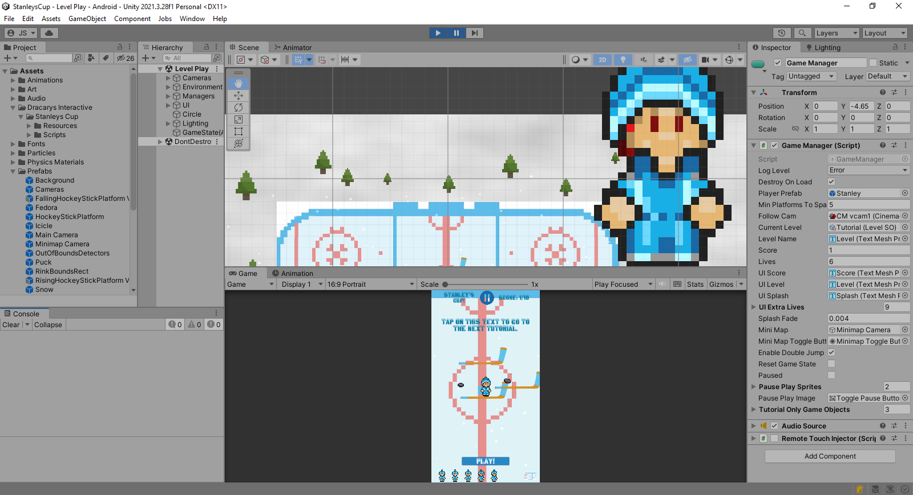

*Dracarys Interactive supplies Unity-based games, tools, and templates for creating quality interactive 2D, 3D, and XR applications.*
# *Stanley's Cup!*

*Stanley's Cup!* is a simple platformer game intended for mobile devices. The player controls the main character through swipe and tap gestures that cause Stanley to walk or jump. The goal of the player is to remain within the boundaries of the hockey rink and collect pucks by hopping between moving hockey stick platforms.

The game begins with a tutorial that allows players to cycle through the essential user 